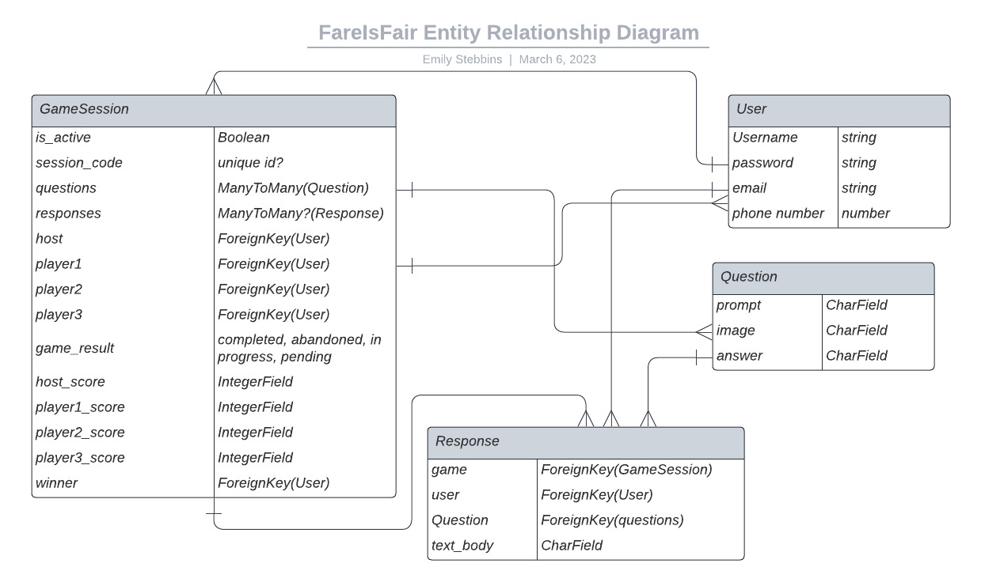

# 
## Full-stack Application Project
==link to live site==

## Overview
This is a full-stack application using Django for the backend and React for the front end (DR stack). This is an interactive group game experience, where users can host and participate in a fun game guessing the cost of products using just their browser, and doing what we all love to do - text the answer! 

### Technologies Used:
- Django
- React 
- Python (D)
- Javascript (R)
- pipenv
- SQL
- twilio https://www.twilio.com 
- Axios?
- Possibly API for game data
- ngrok for sms -> twilio -> http testing during development
- Other Packages/dependencies: django-rest-auth django-cors-headers python-dotenv dj-database-url twilio

## User stories
**As a user (AAU), I want the ability to** 
- Read an about page explaining the app/game without having an account
- Create an account with username, password, phone number, and e-mail
- Sign into my account
### Authenticated Users:
- Logout of my account
- Change my phone number
- Host a game that only people I have invited can participate in
- Invite up to 3 other particpants by looking up their username
- Remove or edit participants
- Participate in a game hosted by another user via text
- Choose length of game - 
- Receive a text inviting me to the game
- See the game's prompts in my browser
- Respond to game prompts via SMS
- See how much time is left to answer a question
- View the participants scores as they are updated
- See the overall winner
- See my game history records (how many games hosted, participated in, scores)

### Version 2 or Stretch Goals User Stories
- Customize game
- Expand # of users
- Choose how to interact (Host game but not participating, answer in browser)
- Winner goes to final round

## Wireframes/Screenshots

## Entity Relationship Diagrams
 [^7]   
** Need DATE! **

## Component Diagram

## Route Tables
#### Games
| **URL**              | **HTTP Verb** |**Actions**|
|----------------------|---------------|-----------|
| /games/mine         | GET           | index
| /games/:id          | GET           | show
| /games/new          | GET           | new
| /games/new          | POST          | create
| /games/:id/edit     | GET           | edit
| /games/:id          | PATCH/PUT     | update
| /games/:id          | DELETE        | destroy   |

#### GameSession
| **URL**              | **HTTP Verb** |**Actions**|
|----------------------|---------------|-----------|
| /play/:gameId/:questionId    | GET           | show
| /play/results/:gameId         | GET           | show | 

#### SMS Route
| /sms    | POST           | show |

#### Authentication: Users

| **URL**              | **HTTP Verb** |**Actions**|**Controller#Action**|
|----------------------|---------------|-----------|---------------------|
| /auth/signup         | POST          | new       | users#signup
| /auth/login          | POST          | create    | users#login
| /auth/logout         | DELETE        | destroy   | users#logout        |

## Approach taken
**Rough Draft Description of Approach:** 

## Installation instructions
**Using the application**

## Unsolved problems

## Project Requirements
Capstone overview. [^2]
Project planning guide. [^1]

### Project Planning
**Sprint 1 (Est completion 3/7/23):**
- [ ] Develop project pitch
- [ ] Create README.md file with project plannings steps
- [ ] Gain project approval

**Sprint 2 (Est completion 3/8/23):**
- [ ] Back-end
- [ ] Review django-api-auth-boilerplate documentation [^3]
- [ ] Review react-auth-boilerplate documentation
- [ ] Follow boilerplate installation instructions [^3]
- [ ] Install other dependencies as needed
- [ ] Ensure API functioning properly from template
- [ ] Begin model 1 build 
- [ ] Seed database and/or incoporate API (for questions)

**Sprint 3 (Est completion 3/11/23):**
- [ ] Front-end
- [ ] Twilio

**Sprint 4 (Est completion 3/12/23):**
- [ ] Enhance styling of pages, get feedback
- [ ] Update responses & error handling for views
- [ ] Conduct extensive views testing & ensure DB connection intact
- [ ] Evaluate readiness for deployment
- [ ] Merge development branch(s) as needed with main

**Sprint 5 (Est completion Delayed 3/14/23):**
- [ ] Deploy application
- [ ] Conduct extensive testing
- [ ] Conduct user acceptance testing
- [ ] Address bugs, errors, feedback
- [ ] Update README.md with all necessary requirements & information
- [ ] Confirm all technical requirements & MVP completion
- [ ] Submit per instructions

**Final Deliverable (Est completion 3/15/23):**
- [ ] Present deliverable to SEI Cohort & Instructors
- [ ] Update documentation to incorporate feedback and development opportunities

**Image & Icon sources**

[^1]: https://git.generalassemb.ly/sei-ec-remote/planning-projects
[^2]: https://git.generalassemb.ly/sei-ec-remote/project_4
[^3]: https://git.generalassemb.ly/sei-ec-remote/django-api-auth-boilerplate
[^7]: used Lucid Chart to develop the final ERD.
